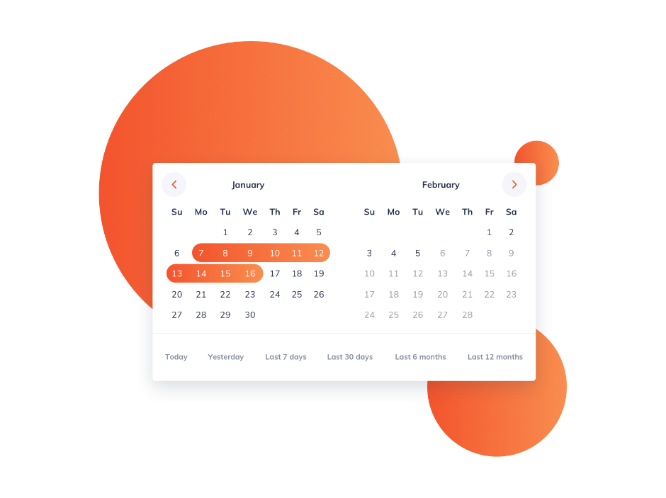

<h1 align="center">
  
</h1>

## 💻 Project

---

This repository was created to store the Project Date Picker, it has one page, this page is responsive and has 2 visibilities, the goal of this project is to practice the concepts of HTML5, CSS3 and JS, without a teacher or any video tutorial to help:

The project's main idea is from [iCodeThis](https://www.icodethis.com/app), which sends a new Project Layout every 24hrs.


- Configure Month Names
  - Modal with a List of Months to Pick one;
  - Render the picked Month Name and Days.
- Select a Day &/OR More then One
  - The user can select a Day;
  - A Day when selected should have a different style
  - When you Select a Day closer to another Selected Day, they should Merge the Styles
  - This Merge have to happen from both sides.
- TODO:
  - A Selected Day, should be Unselected if clicked again
  - The Merged Days closer to this Day should keep the styles
  - The Left and Right Arrows should change the Month according to the direction

## 🧰 Technologies

---

This project was developed with the following technologies:

- HTML
- CSS
- JavaScript
- LiveServer

### 👀 Prerequisites

---

Before starting, you will need to have the following tools installed on your machine:<br/>
[Git](https://git-scm.com) to clone this repository<br/>
A code editor like [VSCode](https://code.visualstudio.com/) and, if you are using VSCode, you can use the [Live Server](https://marketplace.visualstudio.com/items?itemName=ritwickdey.LiveServer) extension to open the project.

### 👨‍💻 Running the Project

---

```bash
# Clone this repository
$ git clone https://github.com/Arthur-Ferreira/DatePicker

# Access the project folder
$ cd DatePicker

# If you're using the Live Server extension
# Right click in the "index.html" file and click in "Open With Live Server"
```

---
<p align="center">
Made with 🖤 by ARTHUR FERREIRA
</p>
